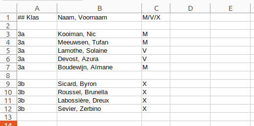

Leerlingen registreren bij de server
===


---
Leerlingen kunnen in groep geregistreerd worden bij de server[^1] door het uploaden van een Excel-bestand. Hoe dan ook moet eerst de *klas* van de
leerlingen zijn toegevoegd aan de school.

###  Klassen

Leerlingen van een school worden gegroepeerd in klassen. Vooraleer je leerlingen kan registreren, moet je eerst de klassen
aanmaken. Dit doe je via de knop *Voeg klassen toe* op de startpagina. Je kan meer dan één klas tegelijk registreren, door
hun namen te scheiden door *komma's*. Klassen met spaties in hun naam (zoals `3 Wet`, `Bolle bozen`), zijn toegelaten 

Klassen moeten elk schooljaar opnieuw worden aangemaakt.

### Leerlingen registreren via een Excel-bestand

Je kan leerlingen in groep registreren door een Excel-bestand te uploaden. Dit bestand moet aan een aantal voorwaarden voldoen:

Lege rijen en rijen waarvan de eerste cel begint met # worden genegeerd. Elke andere rij correspondeert
    met een leerling. Een rij moet verplicht de volgende kolomstructuur hebben:

* Kolom **A**: de **klas** van de leerling. Gebruik dezelfde afkorting waarmee je de klas aan de school hebt
    toegevoegd. **Opgelet!** Klassen moeten reeds zijn aangemaakt vooraleer je dit bestand kan uploaden - zie hierboven.
* Kolom **B**: de **volledige naam** van de leerling. We suggereren dat je hier familienaam, komma, spatie, voornaam gebruikt,
  maar dit is niet verplicht
* Kolom **C**: het **gender** van de leerlingen - M, V of X. Dit wordt enkel gebruikt voor
  de internationale Bebras-statistieken. Je kan X gebruiken als je de privacy van de leerling wil beschermen.

Je hoeft niet alle leerlingen in één bestand te plaatsen of in één keer te uploaden. 
Hetzelfde bestand mag leerlingen bevatten uit verschillende klassen.

Je kan onderstaand [voorbeeldbestand](example.xlsx) downloaden en aanpassen aan je eigen situatie.

Leerlingen moeten elk schooljaar opnieuw worden geregistreerd.

### Bebras-ID en wachtwoord

Bij het uploaden van dit bestand zal de toepassing een *Bebras ID* en een *wachtwoord* genereren
voor de leerlingen. Die hebben ze nodig om in te loggen en aan de wedstrijd deel te nemen. De leerkracht
kan een Excel-bestand downloaden met voor alle leerlingen van de school hun Bebras-ID en hun wachtwoord.

Enkel de leerkracht kan het wachtwoord van een leerling aanpassen.

### Individuele registratie

Leerlingen kunnen ook individueel geregistreerd worden zonder dat dit via een Excel-bestand moet gebeuren. Dit kan via de
leerlingenpagina, bij de betreffende klas, maar ook via de evenementenpagina, wanneer je (op het laatste nippertje) nog een leerling
wil toevoegen en meteen tot dat evenement toegang geven.

#### Voetnoten
[^1]: Niet te verwarren met *inschrijven* bij een [evenement](evenementen.md) 