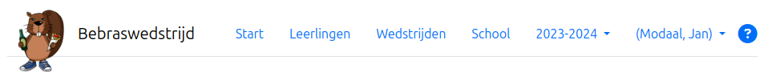

Menu-overzicht
===
Zie ook
* [Documentatie - startpagina](index.html)
* In het kort - [deelnemen aan de Bebras-wedstrijd](kort.html)

#### Het hoofdmenu

{: width="75%"}

Start 
: Klassen en evenementen voor je school. Zie hieronder.

Leerlingen
: [Registratie](registratie.md) van leerlingen bij de server.

Wedstrijden
: Overzicht van alle beschikbare wedstrijden, wedstrijdvragen en oplossingen. Laat ook toe
om alle resultaten van één wedstrijd te bekijken (over alle evenementen heen).

School
: School en geregistreerde leerkrachten. Registreer een collega.

Schooljaar
: Schooljaar dat op dat gebruikt wordt voor de getoonde gegevens. Kan enkel veranderd worden op de startpagina. Bij vorige 
  schooljaren kan je enkel de gegevens bekijken, maar niet meer veranderen[^1].

Ingelogde gebruiker
: Bevat een uitklapmenu (zie verder)

?
: Opent deze documentatiepagina's

#### Uitklapmenu bij de ingelogde gebruiker

* Wachtwoord wijzigen
* Wijzig taal - van de gebruikersinterface
* Corrigeer je naam - als we die verkeerd gespeld zouden hebben
* Afmelden

#### Evenementen

Je vindt die terug op de **Start**-pagina. 

Klikken op de *Details*-knop van een evenement, biedt je de volgende mogelijkheden
* Het evenement openen/sluiten
* Leerlingen inschrijven/uitschrijven voor dat evenement (toelating geven tot deelname)
* Tijdens het evenement: zien wie deelneemt, leerling extra tijd geven, enz.
* Na het evenement: resultaten downloaden

#### Voetnoten
[^1]: Anonimisatie van leerlingen zal wel nog mogelijk zijn voor vroegere schooljaren

